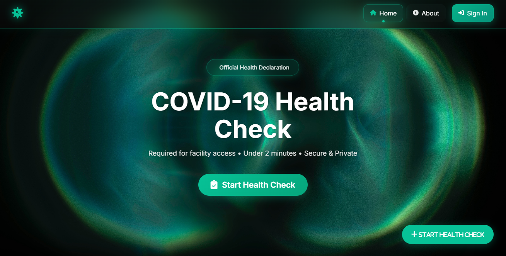
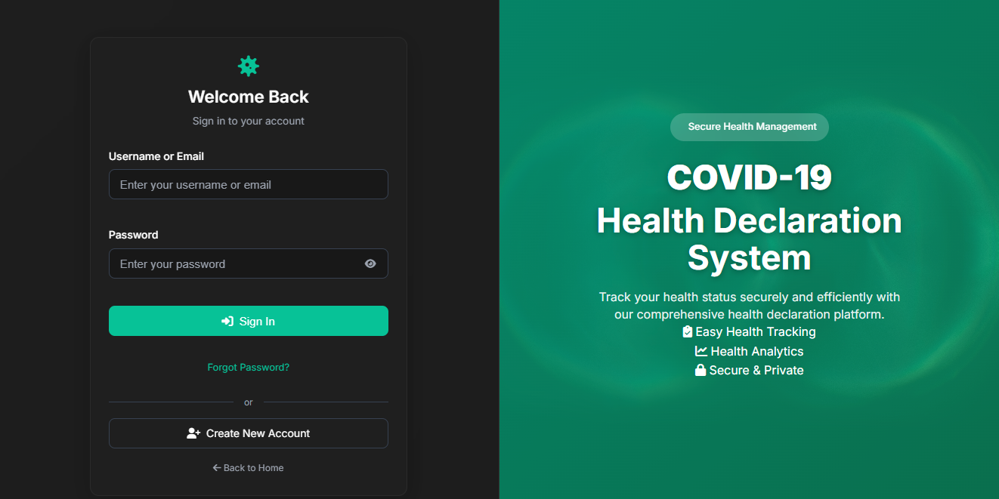
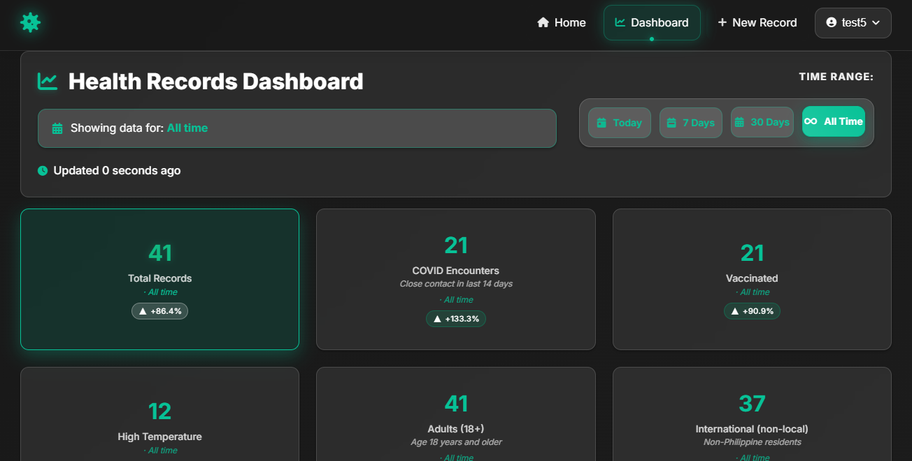
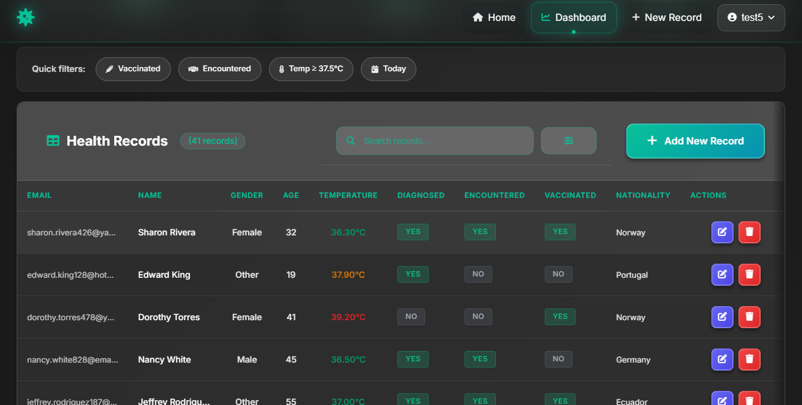

# COVID-19 Health Declaration System

> Enterprise-grade web application for COVID-19 health record management with comprehensive analytics, security hardening, and freemium model


## 🖼️ Screenshots

### 🏠 Landing Page

*Modern, accessible landing page with clear call-to-action and guest usage tracking*

### 🔐 Authentication

*Secure authentication with rate limiting and session management*

### 📊 Analytics Dashboard

*Comprehensive health analytics with real-time KPIs, time-range filtering, and trend analysis*

### 📋 Records Management

*Advanced table interface with search, filtering, and bulk operations*

## ✨ Key Features

### 🏢 **Enterprise Security**

- **SQL Injection Protection** - All queries use prepared statements
- **CSRF Protection** - Comprehensive token validation
- **XSS Prevention** - Input sanitization and output encoding
- **Session Security** - Secure configuration with timeout and regeneration
- **Rate Limiting** - Protection against brute force attacks
- **Security Logging** - Comprehensive audit trail

### 💎 **Freemium Model**

- **Guest Access** - 3 submissions/day with IP-based tracking
- **Premium Users** - Unlimited access for authenticated users
- **Usage Analytics** - Real-time tracking and upgrade prompts
- **Daily Reset** - Automated via Windows Task Scheduler

### 📊 **Advanced Analytics**

- **Real-time KPIs** - Total records, encounters, vaccinations, temperatures
- **Time-based Filtering** - Today, 7 days, 30 days, all time
- **Trend Analysis** - Period-over-period comparisons
- **Export Capabilities** - CSV export with current filters
- **Quick Filters** - Vaccinated, encountered, fever, today

### 🎨 **Modern UX/UI**

- **Dark Theme** - Professional healthcare-focused design
- **Mobile-First** - Responsive design with touch-friendly interactions
- **Accessibility** - WCAG 2.1 AA compliance with keyboard navigation
- **Loading States** - Smooth transitions and feedback
- **Dynamic Navigation** - Scroll-based transparency and blur effects

## 🚀 Quick Start

### Prerequisites

- XAMPP (Apache, MySQL, PHP 7.4+)
- Git

### Installation

```bash
# Clone the repository
git clone https://github.com/transcenddev/covid-health-declaration.git

# Move to XAMPP directory
mv covid-health-declaration C:/xampp/htdocs/

# Import database schema
mysql -u root -p < database/covid19recordsdb.sql
mysql -u root -p < database/add_created_at_column.sql
mysql -u root -p < database/freemium_migration.sql

# Optional: Add performance indexes
mysql -u root -p < database/performance_indexes.sql
```

### Access Application

- **URL:** `http://localhost/covid-health-declaration/`
- **Admin Login:** Username: `Admin`, Password: `Admin`
- **Guest Access:** Use incognito/private browsing to test freemium limits

## 🏗️ Architecture

### Core Components

- **Frontend:** HTML5, CSS3 (Grid/Flexbox), ES6 JavaScript classes
- **Backend:** PHP with MySQLi prepared statements
- **Database:** MySQL with optimized indexes and relationships
- **Security:** Custom security layer with comprehensive protection
- **Freemium:** IP-based usage tracking with automated reset

### File Structure

```
covid-health-declaration/
├── includes/           # Core PHP modules
│   ├── security.inc.php    # Security functions
│   ├── freemium.inc.php    # Usage tracking
│   └── dbconn.inc.php      # Database connection
├── database/          # SQL schema and migrations
├── styles/           # Modular CSS architecture
├── scripts/          # ES6 JavaScript modules
├── logs/            # Security and error logs
└── .github/         # AI coding instructions
```

## 🔧 Development

### Security-First Development

All code follows strict security patterns:

- Prepared statements for all database queries
- CSRF tokens in all forms
- Input sanitization and validation
- Secure session configuration
- Comprehensive error logging

### Debugging

- **Error Logs:** `logs/php_errors.log`
- **Security Events:** `logs/security.log`
- **Freemium Tracking:** `logs/freemium.log`

## 🚀 Production Deployment

### Daily Maintenance

Set up Windows Task Scheduler:

```
Program: C:\xampp\php\php.exe
Arguments: C:\xampp\htdocs\covid-health-declaration\reset_daily_limits.php
Schedule: Daily at 00:01
```

### Security Monitoring

- Monitor `logs/security.log` for suspicious activity
- Regular database backups
- Keep PHP and MySQL updated

## 🤝 Contributing

1. Fork the repository
2. Create a feature branch (`git checkout -b feature/amazing-feature`)
3. Follow security-first development patterns
4. Commit changes (`git commit -m 'Add amazing feature'`)
5. Push to branch (`git push origin feature/amazing-feature`)
6. Open a Pull Request

### Development Guidelines

- Always use prepared statements for database queries
- Include CSRF protection in forms
- Follow the existing code architecture
- Add comprehensive error logging
- Test freemium functionality with multiple IP addresses

## 📄 License

MIT License - see [LICENSE](LICENSE) file for details

## 🙏 Acknowledgments

- Built with security-first principles
- Designed for healthcare environments
- Optimized for accessibility and mobile use

---

⭐ **Star this repository if it helped you build secure health management systems!**
